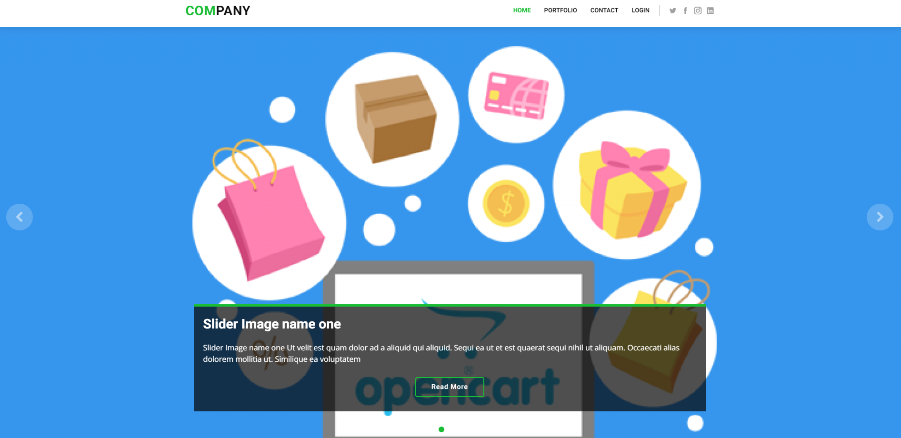
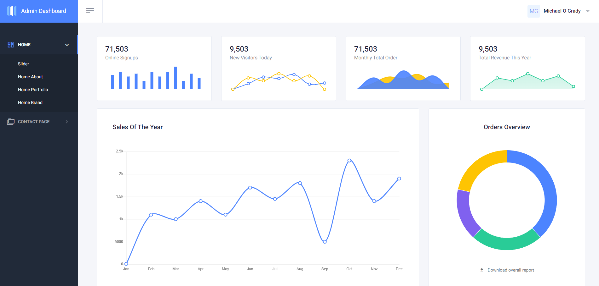

<h1 align="center">Company - Laravel 8 CMS Project</h1>

---

# Table of Contents

- [Table of Contents](#table-of-contents)
- [Introduction](#introduction)
- [Developer Notes](#developer-notes)
- [Instructions to run project locally](#instructions-to-run-project-locally)
- [Primary Routes](#primary-routes)

# Introduction

Company is a _Small Business_ website with portfolio, content management and contact us functionality. The Application is built in Laravel 8 and is a complete end-to-end CMS (Content Management System) where content is managed via backend login for admin users and is highly customizable. The initial project is a starter project with lots of room for improvement in terms of features and functionality that can be built upon.

# Developer Notes

Prior to deploying the application the following considerations need apply.

-   Configuration Caching
    -   To give your application a speed boost, you should cache all of your configuration files into a single file using the config:cache Artisan command. This will combine all of the configuration options for your application into a single file which can be quickly loaded by the framework. [See here](https://laravel.com/docs/9.x/configuration#configuration-caching)
    -   Run:
        -   `php artisan config:cache`
-   Application cache
    -   The application cache is the primary cache in Laravel. It stores everything that you manually cache in your application. You can clear only specific elements of the cache if you use tags or different cache stores. The easiest way to clear the Laravel cache is via artisan:
    -   Run:
        -   `php artisan cache:clear`
-   View cache
    -   Another part of the application that has a cache is the view cache. The view cache stores rendered Blade templates to speed up your application. You can manually render all views to increase the performance by using the artisan command for it:
    -   Run:
        -   `php artisan view:clear`

# Instructions to run project locally

1. Download/Clone Project
2. Run `composer install` within the project directory to install dependencies for the project (ensure composer is installed on your system)
3. Create the `company` database within phpMyAdmin Panel
4. Import `company.sql` to create the tables and populate with data
5. Rename `env_sample.md` to `.env` (sample environment variables for Laravel)
    1. Set up a [mailtrap account](https://mailtrap.io/) to enable reset password, and confirm account functionality. **Required Step**.
    2. Populate the file with the details from your mailtrap account.
6. Run `php artisan serve` to starting a Laravel development server on http://127.0.0.1:8000
7. For Admins:
    1. To create an Admin account to edit and modify data visit `http://127.0.0.1:8000/login`
8. For Users: the website is accessable via: `http://127.0.0.1:8000/`

# Primary Routes

-   Homepage `http://127.0.0.1:8000/`
-   Login for Admins `http://127.0.0.1:8000/login`
